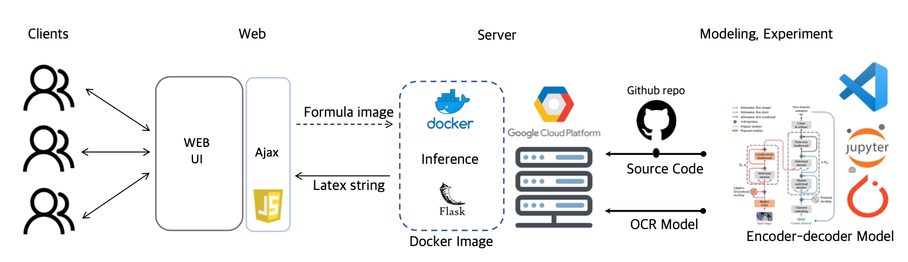

## OCR Serving
수식 인식기 배포

## Members.

[김익재](https://github.com/ijjustinKim) | [남지인](https://github.com/zeen263) | [이주남](https://github.com/joon1230) | [이진성](https://github.com/ssun-g) | [장형주](https://github.com/hangjoo) | [최길희](https://github.com/grazerhee)


## Architecture



### Stack
- Flask
- js
- torch
- docker

### model weight 
학습된 모델을 다운 링크 입니다. core/weight 디렉토리 안에 넣고 모델 불러오는 함수 호출 할때 인자로 해당 파일 경로를 넣어야 합니다.
- SATRN : [Download](https://drive.google.com/file/d/1HhDG3eNpVO4VICIGvZzBsdTbRFS8mODA/view?usp=sharing)

### Docker build & Run
기본적으로 Docker와 nvidia-docker 가 해당 서버 또는 로컬에 설치 되어 있어야 합니다.

__Instance 환경__
- OS: ubuntu16.04 (GCP)
- python 3.7
- cuda: 11.3.1, cudnn:8

docker build 예시
```angular2html
# build
docker bulid -t unnamed_OCR . 
# run
docker run --gpus all -it -p 8000:5000 unnamed_OCR
python3 p4_ocr.py
```


### model 사용 예시

```
from Model.web_inference import OCRModel

# model initialize
model = OCRmodel( token_path = token_path,
            model_path = model_path
         )
# model load
model.load()

# inference
sequence_str, latency = model.inference( image = image )
# iamge = numpy.arr 형태의 이미지 vector (cv2로 불러온)
```